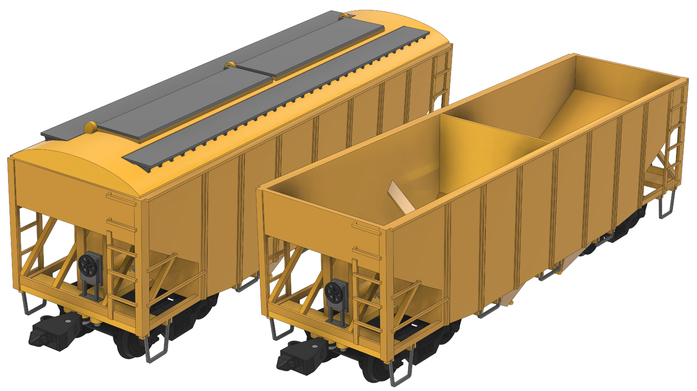
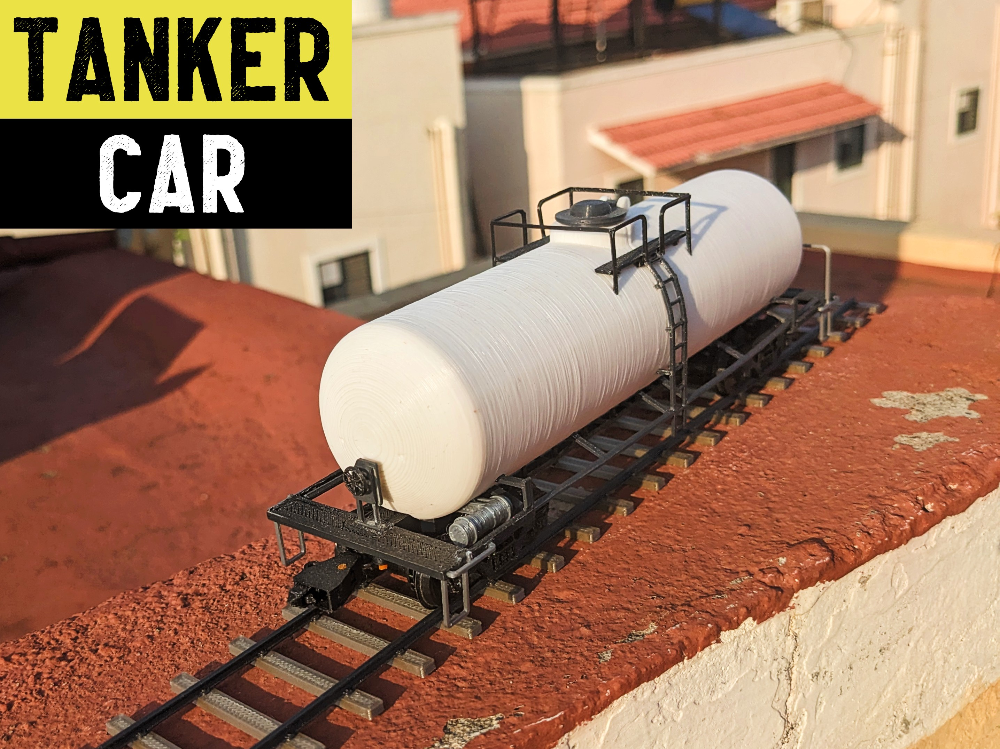

## Open Source cars
**Source CAD files:** [github.com](https://github.com/DragonRailway/Train-Cars)
### 1) Box car 

Box car is versatile since it can be used to carry many types of freight. This box car design has **articulated doors** on the sides.

**Assembly Manual:** [Google docs](https://docs.google.com/presentation/d/1QOl0qDeQsNaM7NYWQ3y_6q2BiEAHNwMJUmY3K6SaFdI)

**Hardware required:**

- M2 6mm screw - 10 pcs

**3D print files:** [printables.com](https://www.printables.com/model/353604)

---
### 2) Hopper Car 
Two types of hopper car are included; **covered hopper car**, which has a roof, and **open hopper car**, which does not have a roof. Discharge doors are present in the bottom.

**Assembly Manual:** [Google docs](https://docs.google.com/presentation/d/1iU-ttXTgNcPpUE42wt78x6EWrf-P82RBcV8F3IRCtmg)

**Hardware required:**

- M2 6mm screw - 4 pcs

**3D print files:** [printables.com](https://www.printables.com/model/357451)

---
### 3) Tanker Car 
 Tanker car is designed to transport liquid commodities. It has an **articulated lid **on top.
 

**Assembly Manual:** [Google docs](https://docs.google.com/presentation/d/1amTaQcBqJWaaYxetjwK-Y26eBoXR3GLliDiPafnYE5A)

**Hardware required:**

- M2 6mm screw - 6 pcs

**3D print files:** [printables.com](https://www.printables.com/model/356543)

---
### 4) Gondola Car 
Open-topped rail car used for transporting loose bulk materials

**Assembly Manual:** [Google docs](https://docs.google.com/presentation/d/102VrKlGLoD_NahUVsSfriT2jJ1hHsR2ZKuGsm1vku_k)

**Hardware required:**

- M2 6mm screw - 2 pcs

**3D print files:** [printables.com](https://www.printables.com/model/356543)

---